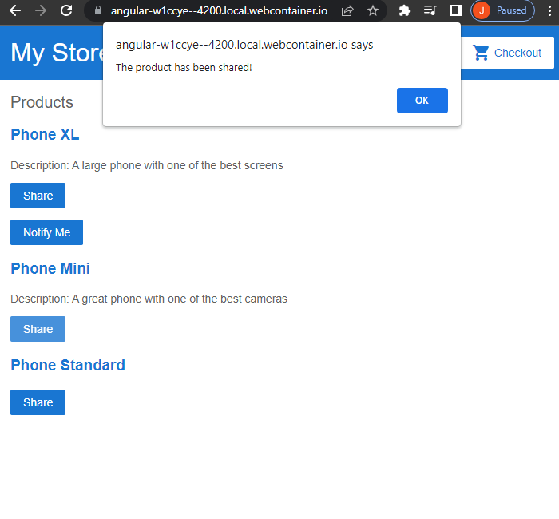
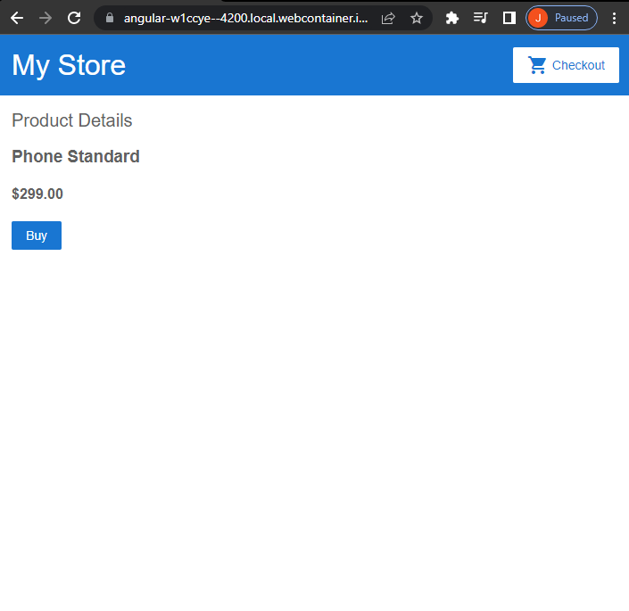
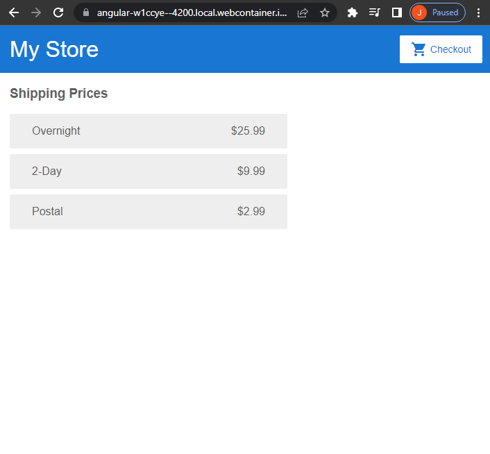
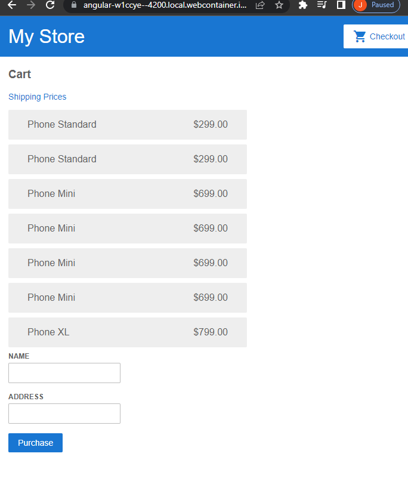

https://angular.io/start

[Edit on StackBlitz ⚡️](https://stackblitz.com/edit/angular-w1ccye)

An introductory scalable web application using Angular.
Angular uses Typescript, the better version of Javascript.
Components suchs as alerts, shipping, details, and cart make up an interactive whole that can easily changed and maintained.

